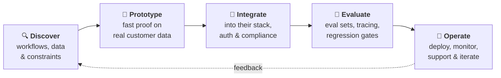
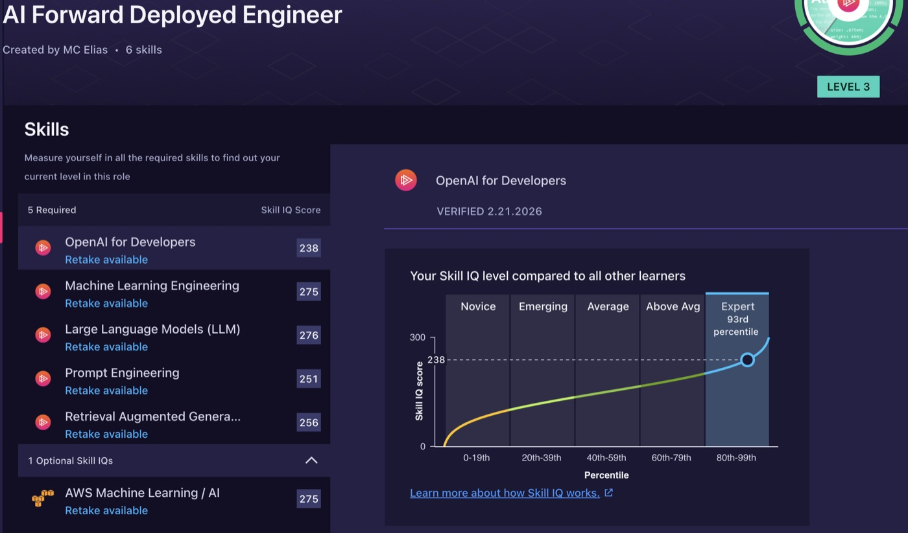
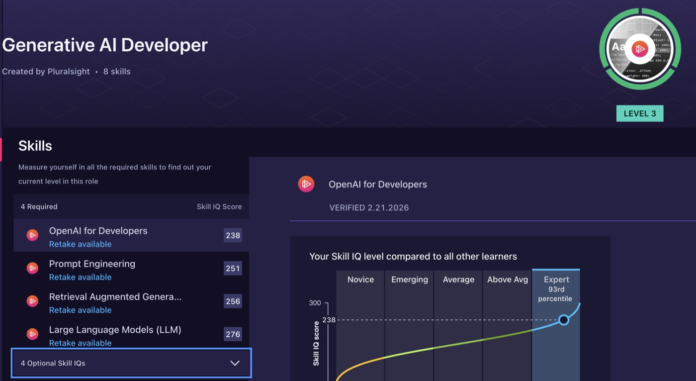
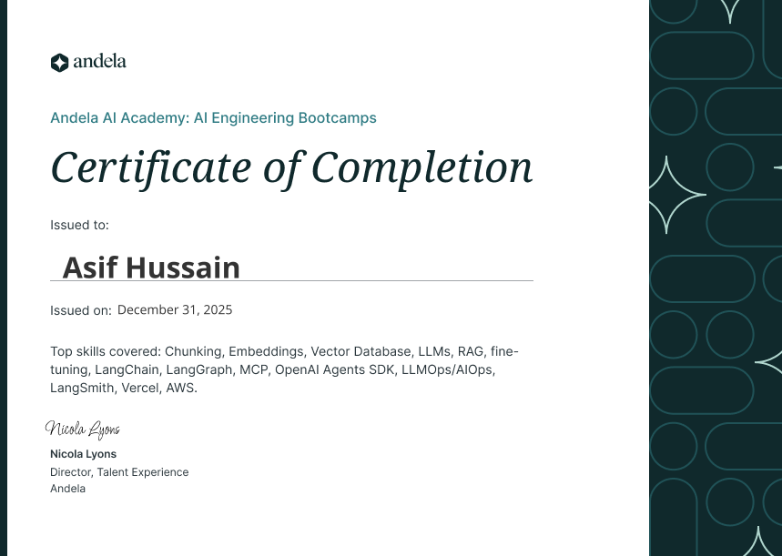
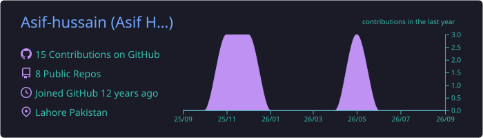
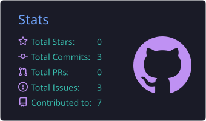
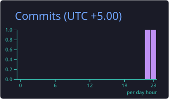
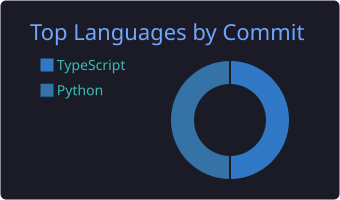
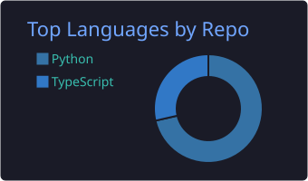

<!--
  This README is a GitHub profile README (repo name == username).
  Banners in assets/banners/ were rendered once with capsule-render and readme-typing-svg
  and are stored here so they never break when those free services are rate limited.
  Other images: skillicons.dev (icon rows), shields.io (badges) and streak-stats.
  The stats cards and the snake are generated by the workflows in .github/workflows/.
-->

<div align="center">



<a href="https://github.com/Asif-hussain"></a>

<p>
  <a href="https://www.linkedin.com/in/asif-hussain-74638671/"></a>&nbsp;
  <a href="https://github.com/Asif-hussain"></a>&nbsp;
  <a href="mailto:asif.bzu.1035@gmail.com"></a>
</p>

<a href="https://tkriver.com/"></a>

<p>
  
  
  
  
</p>

**[👋 About](#-about-me) · [📈 Impact](#-impact-at-a-glance) · [🧩 What I Do](#-what-i-do) · [🚀 How I Deliver](#-how-i-deliver) · [🧱 Systems](#-systems-i-build) · [🧰 Stack](#-tech-stack) · [💼 Experience](#-experience) · [🌟 Projects](#-featured-projects) · [🏆 Certifications](#-certifications-and-assessments) · [📊 Stats](#-github-stats)**

</div>

---

## 👋 About Me

I'm an **AI Engineer and Forward Deployed Engineer** with **13 years** of shipping production software. For the last three years I've focused on one thing: getting **LLM and agent systems past the proof-of-concept stage and into live operation** inside customer environments.

I work **end to end**: discovery with the customer, prototype, integration into their existing stack, evaluation, and production support. My strongest vertical is **regulated industry**, healthcare (HL7, FHIR, HIPAA) and fintech, where AI deployments stall on compliance, data access and auditability rather than on model quality.

Under the AI work sits a decade of **full-stack and data engineering**: Node.js, NestJS and Python backends, React and Next.js frontends, event-driven microservices, and **ETL pipelines** that turn messy source data into clean, queryable warehouses.

- 🔭 **Now:** Technical Lead, AI Systems at [**IdeaToLife**](https://ideatolife.me/) (UAE, remote)
- 🤖 **Shipping:** RAG pipelines, LLM agents and multi-model orchestration on AWS
- 🏥 **Domains:** healthcare, fintech, structured finance, logistics, e-commerce, government benefits
- 🌍 **Teams:** led distributed teams delivering for **US and UAE** customers
- 🧑‍🏫 **Mentoring:** 10+ engineers grown into senior roles
- 💡 **Craft:** clean, testable, maintainable code · SOLID · design patterns · code review · pair programming
- 📍 **Location:** Lahore, Pakistan 🇵🇰
- 🗣️ **Languages:** English (full professional) · Urdu (native)

```text
$ whoami

 █████╗ ███████╗██╗███████╗   ██╗  ██╗██╗   ██╗███████╗███████╗ █████╗ ██╗███╗   ██╗
██╔══██╗██╔════╝██║██╔════╝   ██║  ██║██║   ██║██╔════╝██╔════╝██╔══██╗██║████╗  ██║
███████║███████╗██║█████╗     ███████║██║   ██║███████╗███████╗███████║██║██╔██╗ ██║
██╔══██║╚════██║██║██╔══╝     ██╔══██║██║   ██║╚════██║╚════██║██╔══██║██║██║╚██╗██║
██║  ██║███████║██║██║        ██║  ██║╚██████╔╝███████║███████║██║  ██║██║██║ ╚████║
╚═╝  ╚═╝╚══════╝╚═╝╚═╝        ╚═╝  ╚═╝ ╚═════╝ ╚══════╝╚══════╝╚═╝  ╚═╝╚═╝╚═╝  ╚═══╝

  > AI Engineer · Forward Deployed Engineer · Full-Stack · Data & ETL
  > 13 years in production · Healthcare & Fintech · US / UAE customers
  > status: shipping agent systems at IdeaToLife ●
```

```python
class AsifHussain:
    """AI Engineer · Forward Deployed Engineer · Full-Stack · Data & ETL"""

    role = "Technical Lead, AI Systems @ IdeaToLife"
    years_in_production = 13
    verticals = ["Healthcare (HL7 · FHIR · HIPAA)", "Fintech", "Logistics", "E-commerce"]

    stack = {
        "ai":       ["LangGraph", "LangChain", "MCP", "OpenAI Agents SDK", "Agentic RAG"],
        "evalops":  ["LangSmith", "LangFuse", "tracing", "agent regression tests"],
        "backend":  ["Python", "Node.js", "TypeScript", "NestJS", "Flask", "Laravel"],
        "frontend": ["React", "Next.js", "shadcn/ui"],
        "data":     ["PostgreSQL", "Snowflake", "DuckDB", "ElasticSearch", "MinIO"],
        "cloud":    ["AWS", "GCP", "Docker", "Kubernetes", "Terraform"],
    }

    def deliver(self, idea: str) -> str:
        for step in ("discover", "prototype", "integrate", "evaluate", "operate"):
            print(f"[{step:^11}] {idea}")
        return "live in production · measured · supported"


if __name__ == "__main__":
    print(AsifHussain().deliver("an AI proof of concept that never shipped"))
```

---

## 📈 Impact at a Glance

<table>
  <tr>
    <td align="center" width="33%"><h2>🚀 300%</h2>scalability gain from re-architecting a monolith into microservices</td>
    <td align="center" width="33%"><h2>⚡ 40%</h2>faster API responses across multiple production systems</td>
    <td align="center" width="33%"><h2>🏥 30%</h2>better clinical efficiency from the HL7 / FHIR integration platform</td>
  </tr>
  <tr>
    <td align="center"><h2>🎯 20%</h2>higher diagnostic accuracy on the same clinical platform</td>
    <td align="center"><h2>📅 25%</h2>better on-time delivery after restructuring sprint planning</td>
    <td align="center"><h2>🧑‍🏫 10+</h2>engineers mentored into senior roles</td>
  </tr>
</table>

---

## 🧩 What I Do

<table>
<tr>
<td width="33%" valign="top">

<h3 align="center">🤖 AI & Agent Systems</h3>

<p align="center"></p>

- **Agentic & classic RAG**: chunking, embeddings, re-ranking
- **LLM agents** with LangGraph, LangChain, MCP and the OpenAI Agents SDK
- **Multi-model orchestration** and tool calling
- **EvalOps**: eval pipelines, tracing, agent regression tests
- **MLOps** on AWS: SageMaker, Lambda, fine-tuning, CloudWatch
- **Computer vision**: annotate → train → detect

</td>
<td width="33%" valign="top">

<h3 align="center">🧱 Full-Stack Engineering</h3>

<p align="center"></p>

- **Backends**: Node.js, NestJS, Express, Python/Flask, PHP/Laravel
- **Frontends**: React, Next.js, TypeScript, shadcn/ui
- **Event-driven microservices**: RabbitMQ, BullMQ, MQTT, RPC, WebSockets
- **Payments & auth**: Stripe, Fortapay, Clerk
- **Cloud**: AWS, GCP, Docker, Kubernetes, CI/CD, Terraform
- **Performance**: 300% scale, 40% faster APIs

</td>
<td width="33%" valign="top">

<h3 align="center">🔄 Data & ETL</h3>

<p align="center"></p>

- **End-to-end ETL**: scrape → load → transform → validate
- **Schema design** for normalised warehouses
- **Scheduling** and **data-quality validation**
- **Warehouses & engines**: Snowflake, DuckDB, PostgreSQL
- **Storage**: S3 and MinIO for data-residency customers
- **Clean data** that feeds analytics, dashboards and RAG

</td>
</tr>
</table>

<div align="center">

**Industries I've delivered for**

🏥 Healthcare & Medical Imaging &nbsp;·&nbsp; 💳 Fintech & Banking &nbsp;·&nbsp; 📊 Structured Finance &nbsp;·&nbsp; 🚚 Freight & Logistics <br/>
🛒 E-commerce (Walmart.com) &nbsp;·&nbsp; 🏛️ Government Benefits & Medicaid &nbsp;·&nbsp; 🏃 Sports Medicine &nbsp;·&nbsp; 🍔 Food Delivery

</div>

---

## 🚀 How I Deliver

> *"Most AI projects don't fail on the model. They fail on data access, integration, compliance and the lack of a way to measure behaviour in production. That's the part I own."*



| Phase | What the customer gets |
| :-- | :-- |
| 🔍 **Discover** | Requirement workshops with stakeholders, a clear problem statement, and the data and compliance constraints written down |
| 🧪 **Prototype** | A working slice on their real data, early enough to change direction cheaply |
| 🔌 **Integrate** | The system wired into existing apps, auth, payments, EHRs or data stores, on their cloud or on-prem |
| 📏 **Evaluate** | Eval datasets, tracing and regression tests so behaviour is measured, not demoed |
| 🚀 **Operate** | Monitoring, alerting, support and a roadmap, with me as the primary technical contact |

---

## 🧱 Systems I Build

### 🤖 Agentic RAG & LLM agents in production

```text
                      ┌─────────────────────────────────┐
                      │   Customer apps · APIs · chat   │
                      └────────────────┬────────────────┘
                                       ▼
               ┌───────────────────────────────────────────────┐
               │         AGENT ORCHESTRATOR · LangGraph        │
               │     plan ► retrieve ► call tools ► answer     │
               └───────────────────────┬───────────────────────┘
            ┌──────────────────────────┼──────────────────────────┐
            ▼                          ▼                          ▼
  ┌───────────────────┐      ┌───────────────────┐      ┌───────────────────┐
  │     RETRIEVER     │      │    TOOLS · MCP    │      │     LLM ROUTER    │
  │ agentic / classic │      │   customer APIs   │      │    multi-model    │
  │  top-k + re-rank  │      │  DBs · workflows  │      │    tool calling   │
  └─────────┬─────────┘      └───────────────────┘      └───────────────────┘
            ▼
  ┌───────────────────┐
  │    VECTOR STORE   │ ◄── ingest: load ► chunk ► embed ► upsert
  └───────────────────┘
  Pinecone · pgvector · Qdrant · ChromaDB · Weaviate

══════════════════════════════════════════════════════════════════════════════
 EVALOPS │ LangSmith / LangFuse traces ► eval sets ► regression gate
 MLOPS   │ AWS Lambda · SageMaker endpoints · ECR · CloudWatch alarms
 DEPLOY  │ customer AWS account or on-prem + MinIO for data residency
══════════════════════════════════════════════════════════════════════════════
```

### 🧱 Full-stack platform (fintech-grade)

```text
┌──────────────────────────────────────────────────────────────────────────┐
│           FRONTEND   Next.js · React · TypeScript · shadcn/ui            │
└────────────────────────────────────┬─────────────────────────────────────┘
                                     ▼  Clerk auth · JWT · HTTPS
┌──────────────────────────────────────────────────────────────────────────┐
│         API GATEWAY   routing · auth · rate limits · validation          │
└────────┬──────────────────┬──────────────────┬──────────────────┬────────┘
         ▼                  ▼                  ▼                  ▼
 ┌───────────────┐  ┌───────────────┐  ┌───────────────┐  ┌───────────────┐
 │    ACCOUNTS   │  │    PAYMENTS   │  │    WORKERS    │  │   AI SERVICE  │
 │     NestJS    │  │     Stripe    │  │     BullMQ    │  │  RAG · agents │
 │    Express    │  │    Fortapay   │  │  cron · jobs  │  │  Python/Flask │
 └───────┬───────┘  └───────┬───────┘  └───────┬───────┘  └───────┬───────┘
         │                  │                  │                  │
         └──────────────────┴────────┬─────────┴──────────────────┘
                                     ▼
┌──────────────────────────────────────────────────────────────────────────┐
│        EVENT BUS   RabbitMQ · Redis · pub/sub · MQTT · WebSockets        │
└────────────────────────────────────┬─────────────────────────────────────┘
                                     ▼
┌──────────────────────────────────────────────────────────────────────────┐
│     DATA   PostgreSQL · MongoDB · Redis · ElasticSearch · S3 / MinIO     │
└──────────────────────────────────────────────────────────────────────────┘
  RUNS ON ► Docker · Kubernetes · AWS / GCP · CI/CD · Terraform · CloudWatch
```

### 🔄 ETL & data pipelines

*The pattern behind the **Credit Union Data Pipeline**: I owned extraction, schema design, transformation logic, scheduling and data-quality validation.*

```text
┌───────────────┐   ┌───────────────┐   ┌───────────────┐   ┌───────────────┐
│   1. EXTRACT  │   │    2. LOAD    │   │  3. TRANSFORM │   │  4. WAREHOUSE │
│  web scrapers │──►│  raw landing  │──►│  clean · map  │──►│   normalised  │
│  source APIs  │   │      zone     │   │   normalise   │   │     schema    │
│  with retries │   │   S3 · MinIO  │   │ Python·DuckDB │   │  Snowflake·PG │
└───────┬───────┘   └───────┬───────┘   └───────┬───────┘   └───────┬───────┘
        │                   │                   │                   │
┌───────┴───────────────────┴───────────────────┴───────────────────┴───────┐
│ ORCHESTRATE  scheduled runs · job queues · retries · alerting             │
│ QUALITY      row counts · schema checks · dedupe · reconciliation         │
│ GOVERN       lineage · versioned transforms · reproducible backfills      │
└─────────────────────────────────────┬─────────────────────────────────────┘
                                      ▼
┌───────────────────────────────────────────────────────────────────────────┐
│        SERVE   dashboards · analytics · APIs · RAG over clean data        │
└───────────────────────────────────────────────────────────────────────────┘

    ETL design · web scraping · transformation · warehousing · validation
```

### 🏥 Healthcare interoperability (HL7 / FHIR)

```text
┌──────────────────┐  ┌──────────────────┐  ┌──────────────────┐
│    EHR / EMR     │  │     CLINICAL     │  │    DIAGNOSTIC    │
│     systems      │  │     systems      │  │    platforms     │
└─────────┬────────┘  └─────────┬────────┘  └─────────┬────────┘
          └─────────────────────┼─────────────────────┘
                                ▼  HL7 v2 · FHIR · CDA
            ┌────────────────────────────────────────┐
            │           INTEGRATION LAYER            │
            │     parse ► validate ► map ► route     │
            └───────────────────┬────────────────────┘
                                ▼  pub/sub
            ┌────────────────────────────────────────┐
            │     HIPAA-COMPLIANT MICROSERVICES      │
            │   imaging · worklists · reports · AI   │
            └───────────────────┬────────────────────┘
                                ▼
            ┌────────────────────────────────────────┐
            │ CLINICAL USERS  ·  real-time exchange  │
            └────────────────────────────────────────┘
    encryption · audit trail · least-privilege access · PHI safety
```

---

## 🧰 Tech Stack

<div align="center">


<br/><br/>

<br/><br/>


</div>

<br/>

| Area | Tools & skills |
| :-- | :-- |
| 🤖 **LLM & Agents** |        |
| 🔎 **Retrieval & Vector DBs** |           |
| 📏 **EvalOps & Observability** |      |
| ⚙️ **MLOps** |      |
| 🖥️ **Backend** |          |
| 🎨 **Frontend** |       |
| ☁️ **Cloud & Infra** |          |
| 🔀 **Architecture & Messaging** |          |
| 🗄️ **Data & ETL** |            |
| 🔐 **Integrations & Compliance** |         |
| 🧪 **Testing, Tools & Delivery** |            |

---

## 💼 Experience

```text
  2014 ──●── Virtual-Base ·········· Software Engineer
         │   API test plans · Node.js
         │
  2015 ──●── Bitbean ··············· Senior Software Engineer
         │   Walmart.com · KTS Trust
         │
  2017 ──●── Transdata ············· Senior Software Engineer
         │   Node.js · Laravel · CI
         │
  2021 ──●── Interlink Multimedia ·· Senior Backend Engineer
         │   Node.js · Docker
         │
  2022 ──●── Maven Machines ········ Senior Backend Engineer
         │   logistics · MQTT
         │
  2022 ──●── Synthesis Health ······ Senior Backend Engineer
         │   HL7 · FHIR · HIPAA
         │
  2022 ──●── IdeaToLife ············ Technical Lead, AI Systems
         ▼   RAG · agents · AWS
        NOW ► taking LLM & agent systems from proof of concept to production
```

### 🧠 Technical Lead, AI Systems · [IdeaToLife](https://ideatolife.me/)
`Dec 2022 – Present` · 🇦🇪 UAE (Remote)

           

- 🤖 Own **AI product delivery end to end** for enterprise customers: scoping with the client, prototype, production integration and ongoing operation.
- 🔎 Shipped **RAG pipelines, LLM agents and multi-model orchestration** integrated into customers' existing systems and data.
- 📏 Built **evaluation and observability** into agents so production behaviour is measurable and regressions are caught before customers see them.
- 🧱 Led the **monolith → microservices** migration for a **300% scalability gain**.
- ☁️ Own AWS infrastructure across **EC2, ECR, Lambda, SageMaker, S3, IAM, CloudWatch** and managed endpoints, plus on-prem servers and **MinIO** for customers with data-residency requirements.
- 💳 Integrated **Stripe and Fortapay** payments, **Clerk** auth, **HL7 and FHIR** interoperability, and **Redis and RabbitMQ** for async processing.
- 👁️ Led an **AI object-detection platform** where users annotate images, train models and run detection with the trained models.
- 🤝 Primary technical contact for customers: requirement discovery, solution walkthroughs and delivery updates.
- 🧑‍🏫 Run engineering: architecture, sprint planning, code review, mentoring and delivery accountability.

### 🩻 Senior Backend Engineer · [Synthesis Health](https://synthesis.health/) (via Zazmic)
`Jun 2022 – Dec 2022` · 🇺🇸 USA (Remote)

         

- 🏥 Built the core **teleradiology and medical imaging platform** serving clinical users; the platform improved **clinical efficiency by 30%** and **diagnostic accuracy by 20%**.
- 🔗 Designed **HL7 and FHIR interfaces** for real-time exchange across clinical systems, EHRs and diagnostic platforms.
- 🔐 Stood up **HIPAA-compliant microservices** with pub/sub messaging, cloud functions and HL7 v2 parsing.
- 🩺 Worked directly with clinical stakeholders to turn domain requirements into system design.
- 🔍 Drove sprint planning and code reviews, resolved high-priority technical issues and mentored junior developers.

### 🚚 Senior Backend Engineer · Maven Machines (via Andela)
`Feb 2022 – Jun 2022` · 🇺🇸 USA (Remote)

       

- 🚛 Built **freight and logistics optimisation** systems on RabbitMQ, RPC, MQTT, TypeScript and Laravel.
- 📐 Designed a **microservices architecture sized for projected growth**, with reliable database components.
- 🤝 Gathered requirements with the client, ran code reviews and gave hands-on coding help to the team.

### 🧩 Senior Backend Engineer · Interlink Multimedia
`Feb 2021 – Dec 2021` · 🇵🇰 Pakistan

      

- 🏗️ Architected and owned **new Node.js modules** end to end.
- 🐳 Managed **Docker deployments** and CI pipeline health.
- 📊 Ran technical risk assessment and delivery estimation.

### 📦 Senior Software Engineer · Transdata
`Dec 2017 – Jan 2021` · 🇵🇰 Pakistan

      

- 🎯 Delivered Node.js and Laravel projects with **full ownership of scope, timeline and client communication**.
- 🧑‍🏫 Mentored junior engineers across planning, development and deployment.
- ⚙️ Set **CI standards** and configuration management, and wrote documentation for development and support.

### 🛒 Senior Software Engineer · Bitbean
`Feb 2015 – Dec 2017` · 🇵🇰 Pakistan (US clients)

     

- 🛍️ Delivered features for **Walmart.com** at consumer scale.
- 🏛️ Built the **KTS Pool Trust** Medicaid management system.
- 🧪 Maintained enterprise test suites: unit, functional and integration testing with **Mocha**.
- 🤝 Worked directly with clients on requirements, system analysis and design in a fast agile environment.

### 🧪 Software Engineer · Virtual-Base
`Jan 2014 – Feb 2015` · 🇵🇰 Pakistan

   

- 📋 Built functional and performance **API test plans** for server-side Node.js applications.
- 🧭 Advised distributed teams on API design.

---

## 🌟 Featured Projects

<table>
<tr>
<td width="50%" valign="top">

### 💳 [TAPP Engine](https://www.tappengine.com/)
`Fintech infrastructure`

Fintech infrastructure platform built on React, Next.js and Node.js microservices, with hardened security and payment flows.

    

</td>
<td width="50%" valign="top">

### 📊 [9Squid](https://www.9squid.ai/)
`AI · Structured finance`

AI-powered structured finance product delivering automated analytics and model-driven insight over complex financial instruments.

   

</td>
</tr>
<tr>
<td width="50%" valign="top">

### 🏦 [TAPP Cash](https://marketing-website.tappcash.com/why-tappcash)
`Banking · White label`

RIA-native banking platform with a hierarchical account architecture and full white-label capability for partner institutions.

   

</td>
<td width="50%" valign="top">

### 🩻 [Synthesis Health](https://synthesis.health/)
`Healthcare · Teleradiology`

Teleradiology and medical imaging platform on a HIPAA-compliant microservices architecture with HL7 and FHIR interoperability.

    

</td>
</tr>
<tr>
<td width="50%" valign="top">

### 🏃 [Disc Dubai](https://dubai.disc-me.com/)
`Healthcare · AI agent`

Sports medicine and healthcare platform with multi-location booking and embedded AI agent capabilities.

   

</td>
<td width="50%" valign="top">

### 🏛️ [KTS Trust](https://ktstrust.org/)
`Government benefits · Medicaid`

Government benefits and Medicaid pooled trust platform with compliance reporting and eligibility workflows.

   

</td>
</tr>
<tr>
<td width="50%" valign="top">

### 🔄 Credit Union Data Pipeline
`Data engineering · ETL`

End-to-end ETL system that scraped, loaded and transformed credit union financial data into a normalised warehouse. Owned extraction, schema design, transformation logic, scheduling and data-quality validation.

    

</td>
<td width="50%" valign="top">

### 🔎 QueryStack
`AI · Query engine`

AI query engine combining retrieval-augmented generation, embeddings and multi-model orchestration, deployed on AWS.

   

</td>
</tr>
<tr>
<td width="50%" valign="top">

### 👁️ AI Object Detection Platform
`Computer vision · IdeaToLife`

Project lead. A tool that lets users annotate images, train models, and then use the trained models for object detection.

     

</td>
<td width="50%" valign="top">

### 🍔 Tamu App
`Freelance · Food delivery`

Web app for food ordering, delivery and payments, built with Node.js and Angular.

    

</td>
</tr>
</table>

---

## 🏆 Certifications and Assessments

<div align="center">


<br/>


</div>

```text
PLURALSIGHT SKILL IQ  ·  Expert tier in all six  ·  verified 21 Feb 2026

AWS Machine Learning & AI..... ███████████████████▌  98th pct · score 275
Large Language Models......... ███████████████████▌  98th pct · score 276
Machine Learning Engineering.. ███████████████████▌  98th pct · score 275
RAG for Developers............ ███████████████████░  96th pct · score 256
Prompt Engineering............ ███████████████████░  96th pct · score 251
OpenAI for Developers......... ██████████████████▌░  93rd pct · score 238

ROLE IQ  ►  AI Forward Deployed Engineer ...... LEVEL 3 / 3  ★★★
         ►  Generative AI Developer ........... LEVEL 3 / 3  ★★★
```

🎓 **Andela AI Academy: AI Engineering Bootcamp** (Dec 2025): chunking, embeddings, vector databases, LLMs, RAG, fine-tuning, LangChain, LangGraph, MCP, OpenAI Agents SDK, LLMOps / AIOps, LangSmith, Vercel and AWS.

<details>
<summary><b>🖼️ View certificates</b></summary>
<br/>
<p align="center">
  
  
</p>
<p align="center">
  
</p>
</details>

---

## 🎓 Education

🎓 **B.Sc. Information Technology** · Bahauddin Zakariya University, Multan, Pakistan · `2010 – 2014`

---

## 📊 GitHub Stats

<!--
  Stats cards are generated by .github/workflows/profile-cards.yml into
  profile-summary-card-output/tokyonight/ (the hosted github-readme-stats and
  github-profile-summary-cards APIs are shared and get rate limited).
  The snake is built by .github/workflows/snake.yml and served from the `output` branch.
-->

<div align="center">









<picture>
  <source media="(prefers-color-scheme: dark)" srcset="https://raw.githubusercontent.com/Asif-hussain/asif-hussain/output/github-snake-dark.svg"/>
  <source media="(prefers-color-scheme: light)" srcset="https://raw.githubusercontent.com/Asif-hussain/asif-hussain/output/github-snake.svg"/>
  
</picture>

</div>

---

## 🤝 Let's Connect

<div align="center">

I'm open to **AI Engineer** and **Forward Deployed Engineer** roles, and to conversations about<br/>
getting agent systems into production in **healthcare** and **fintech**.

<a href="https://www.linkedin.com/in/asif-hussain-74638671/"></a>
<a href="mailto:asif.bzu.1035@gmail.com"></a>
<a href="https://github.com/Asif-hussain"></a>
<a href="https://tkriver.com/"></a>

```text
  ┌──────────────────────────────────────────────────────────────┐
  │  "Ship it, measure it, support it."  Thanks for stopping by! │
  └──────────────────────────────────────────────────────────────┘
```


</div>
